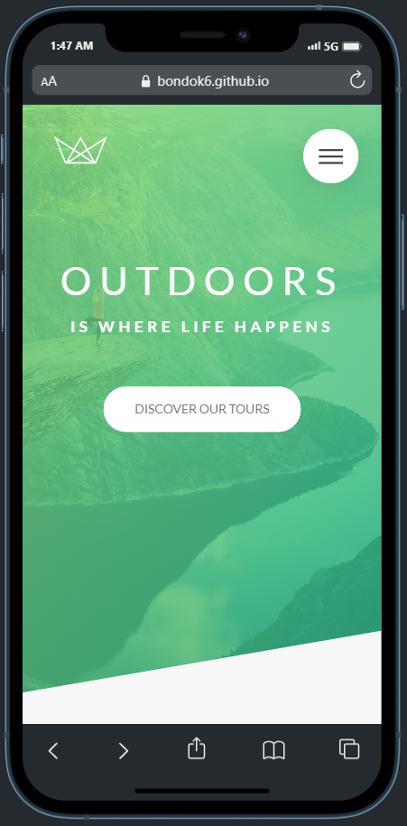
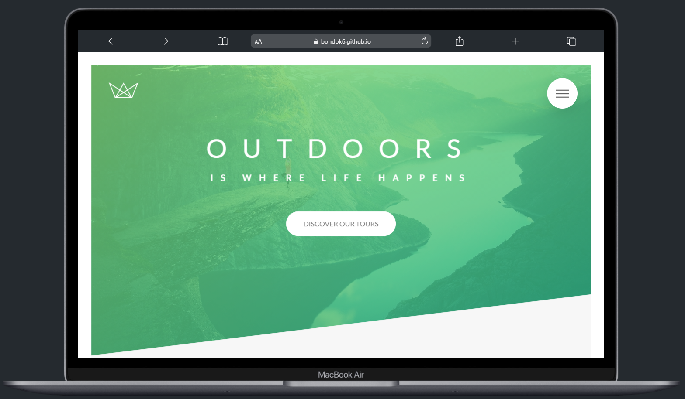

# Natours

> ### Pure CSS website to practice the latest advanced CSS features.

## Built With

- HTML - HTML5
- CSS - CSS3
- Sass - Scss

## Additional Used

- Google Fonts
- Linea Icons
- npm

## Live Demo

[Natours Live Demo](https://bondok6.github.io/Natours/)

## Getting Started

To get a local copy up and running follow these simple example steps.

`git clone git@github.com:Bondok6/Natours.git`

## Authors

👤 **Author1**

- GitHub: [@Bondok6](https://github.com/Bondok6)
- LinkedIn: [LinkedIn](https://linkedin.com/in/linkedinhandle)

## 🤝 Contributing

Contributions, issues, and feature requests are welcome!

Feel free to check the [issues page](../../issues/).

## Show your support

Give a ⭐️ if you like this project!

## Acknowledgments

- Inspired by Jonas Schmedtmann for his online course **Advanced CSS and Sass**

## 📝 License

This project is [MIT](./MIT.md) licensed.
